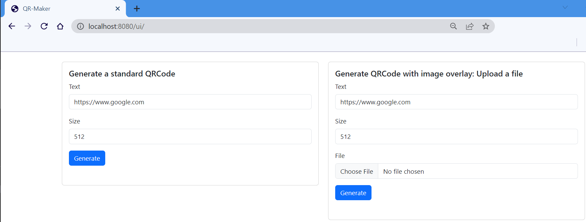

# QR-Generator
## Introduction
QR-Generator is a small REST application that can be used to generate your QR-Code.
It's API supports two kind of QR Code:
- `/qrcode`: generates a simple black and white QR Code
- `/qrcode-overlay`: generates a QR Code with logo overlay.

It is written in Golang using [Gin Web Framework](https://pkg.go.dev/github.com/gin-gonic/gin) and [go-qrcode](https://pkg.go.dev/github.com/skip2/go-qrcode) library for this reason it's very fast and lightweight.

The project is opensource and if you want you can build it again or change it's logic.

## How to use it

### Build and run locally
You can build the project using the following command:
```
go build -o app .
```
And run it locally:
```
./app
```

### Docker
The image is already present on [Docker Hub](https://hub.docker.com/repository/docker/rmarcello/qr-generator).

Otherwise you can build your own:
```
docker build -t qr-generator:latest .
```

To run with docker you can use this:
```
docker run -p 8080:8080 -it --rm --name qr-generator rmarcello/qr-generator:latest
```

## How it works
The REST application listen on HTTP 8080 port. It provedes a simple REST API and a UI.

### UI
You can access the UI from a browser using the `/ui` url. From here you can choose a QRCode type and generate it.



### API

If you need a simple QRCode you can use the `/qrcode` API using the GET method.
The API returns a PNG file that can be saved in a file.

Here's an example:

```
curl "http://localhost:8080/qrcode?txt=http://www.google.com&size=512" --output img.png
```

If you need a QR Code with logo overlay, you can use the `/qrcode-overlay` API using the POST method in order to upload the file that you want to use as logo. The image must be in PNG format, it will be resized and overlayed on the generated QR Code.
For the logo, choose 150x150px size. 

```
curl "http://localhost:8080/qrcode-overlay" \
    -X POST \
    -F txt=http://www.google.com \
    -F size=512 \
    -F 'file=@"logo.png"' \
    --output qrcode-with-logo.png
```